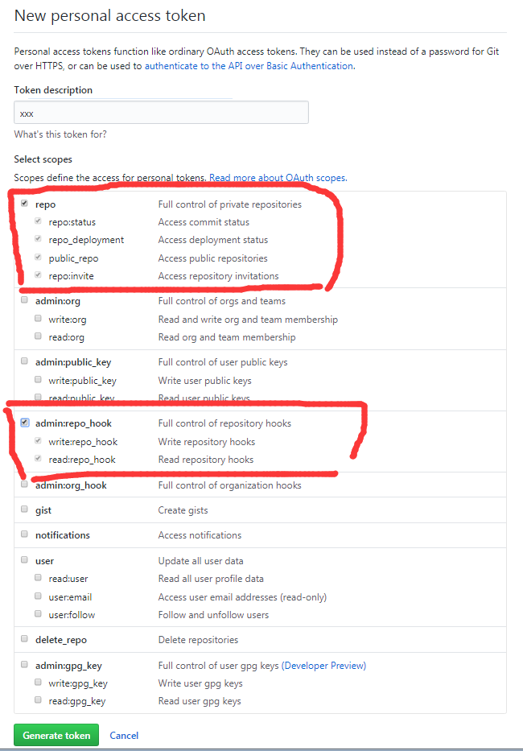

#### 介绍
* docker:简单的说,如果你用docker构建一个rabbitMQ集群之类的,将其打包成一个镜像.或者你直接拉取别人配置好的镜像,可以直接在
本机0配置的运行一个安装有mq集群容器(类似虚拟机).
* Jenkins:可以从git或github等代码源,自动拉取代码,进行你想要的测试/构建操作,或shell脚本等.
* 简单介绍下我要实现的效果:
    1. 在docker容器中运行jenkins.
    2. jenkins自动监听我的Github项目,当我提交新的代码时,
    3. jenkins自动拉取该代码到本地,使用maven打包后,关闭上个版本的该项目,然后使用java jar命令运行最新的jar(spring boot).
    

#### Docker安装及基本操作
* Docker (CE)小企业或个人,此处是CE
* Docker (EE)企业级

* 安装及启动
>   
    CentOS
    前置环境安装
        yum install -y yum-utils \
          device-mapper-persistent-data \
          lvm2
          
    设置稳定的存储库
        yum-config-manager \
            --add-repo \
            https://download.docker.com/linux/centos/docker-ce.repo
        非必须 开启edge和test存储库库等  这样可以禁用yum-config-manager--disable docker-ce-edge
        yum-config-manager --enable docker-ce-edge 
        yum-config-manager --enable docker-ce-test
        
    安装
        yum install docker-ce
    
    启动docker(配置文件 /etc/sysconfig/docker)
        systemctl start docker
    
    开机启动等
        systemctl enable docker
        systemctl disable docker
        chkconfig docker on
    
    测试(这个命令下载一个helloword镜像并在容器中运行。容器运行时，会打印一条信息消息。)
        docker run hello-world
    
    卸载
        yum remove docker-ce
        rm -rf /var/lib/docker # 删除镜像容器等
>

* 常用命令(使用容器或镜像id时,无需全部id,只需前几个字符即可,也可使用 容器镜像名:版本号 操作)
>   
    重要:xx表示不同的命令如，pull、run等。可以查看该命令的帮助，所有参数
    docker xx --help
    
    查看本机的镜像,可通过该方法查看到镜像id等信息.
    docker images 
    
    获取镜像 name：镜像名  [:tag]：版本，默认为最新的（也就是会自己加上一个参数:latest）
    docker pull [options] name[:tag]
    
    删除镜像,需要删除其下所有容器
    docker rmi <镜像id>
    
    运行镜像,构建出一个容器. -d表示后台运行. 
    docker run -d image 
    -p 8080:80  进行端口映射，将nginx的80端口映射到主机的8080端口上，也就是别人访问8080，可以访问到自己的80
    
    查看目前正在运行的容器
    docker ps
    
    查看所有容器
    docker ps -a
    
    停止容器
    docker stop <容器id>
    
    删除容器
    docker rm <容器id>
    
    启动一个运行(run)过的容器
    docker start <容器id>
    
    在运行的容器中执行命令 
    docker exec [options] container command [arg...]
    例如:   
    docker exec -it <容器id> bash
    可以进入一个容器，和虚拟机中一样。也就是容器内部
    
    挂载目录:将宿主机的文件共享给容器
    docker run -d --name=test -v /opt/test:/usr/databases docker-test 
    test是容器的名字，需唯一；
    -v表示创建一个数据卷并挂载到容器里，
    示例表示把宿主机的/opt/test目录挂载到容器的/usr/databases目录下；
    docker-test是镜像的名字
    
    查看容器当前信息,可在该命令的 Mounts信息中,找到挂载目录信息
    docker inspect <容器id>
    
    
    
    制作镜像
    以下就是 打包镜像tomcat和jpress.war
    在某个目录创建文件 Dockerfile 编辑输入如下内容：
        # （继承自哪个镜像）注意,注释不能添加在和命令同行,会报错
        from images(镜像名)   
        # (维护人员信息)
        MAINTAINER ZX 970389745@qq.com  
        # (同一目录下要打包成镜像的文件,拷贝到tomcat的运行目录下)
        COPY jpress.war  /usr/local/tomcat/webapps  
    
    此外,有更多命令
    RUN : 执行容器中操作系统的命令(例如是CentOS,可以执行 cp mv 等等.)  
    EXPOSE : 指定该容器暴露的端口,可以通过多个EXPOSE暴露多个端口
    ENV : 设置环境变量 例如 ENV JAVA_HOME /var/java
    ADD : 将本地文件拷贝到容器中.例如 /var/xxx.tar.gz  /var 
    CMD : 容器启动时执行的命令,最多一条. 
    其他命令自行搜索.
    
    然后在目录下使用  
    即可创建镜像，注意， . 是当前目录的意思
    docker build .   
    下面这句 -t是创建镜像并命名， :laster是版本号 ,因为上面的镜像没有命名
    docker build  . -t jpress:latest
    
    运行容器
    -d表示后台运行 -p表示设置端口映射， jpress是镜像名
    docker run -d -p  8888:8080 jpress
    
    运行mysql镜像
    docker run -d -p 3306:3306 -e MYSQL_ROOT_PASSWORD=123456 -e MYSQL_DATABASE=xxx  images(镜像名)
>

* 使用阿里云的Docker镜像加速器
>
    管理控制台 -> 容器镜像服务 -> 镜像加速器 -> 获取到其分配的加速地址
    修改 /etc/docker/daemon.json 文件,增加如下,没有时创建
      {
        "registry-mirrors": ["加速地址"]
      }
    
>

* 可在阿里云免费开通 容器镜像服务,创建仓库,将镜像推送过去

#### Jenkins 持续集成 

* 前置
    * JDK8
    * Docker
* 使用docker下载镜像jenkinsci/blueocean,并启动运行Jenkins容器
>
    docker run \
          -u root \
          -d \
          -p 8080:8080 \
          -v jenkins-data:/var/jenkins_home \
          -v /var/run/docker.sock:/var/run/docker.sock \
          jenkinsci/blueocean
    
    官方文档中还有一个 --rm . 但是提示 -d 和 --rm 相互冲突
    其容器中的/var/jenkins_home 被挂载到了我本地的 /var/lib/docker/volumes/jenkins-data/_data 目录下
>
* 进入Jenkins容器执行命令
> docker exec -it <容器id> bash
* 查看容器输出的日志
> docker logs <容器id> [-f(滚动的)]
* 或者自行下载war包运行
> java -jar jenkins.war --httpPort=8080

* 可以创建一个基于Jenkins镜像的整合maven的新镜像(jdk在jenkinsci/blueocean中已经有一个oepn_jdk(目前没发现有什么问题))
>   
    下载maven 
    wget http://mirror.bit.edu.cn/apache/maven/maven-3/3.5.2/binaries/apache-maven-3.5.2-bin.tar.gz

    Dockerfile文件内容
         #继承自jenkins镜像
         FROM jenkinsci/blueocean:latest  
         #维护人员信息
         MAINTAINER ZX 970389745@qq.com  
         # 拷贝本地的maven解压包到镜像的/usr下
         ADD apache-maven-3.5.2-bin.tar.gz /var
         # 下载并解压jdk和maven,使用RUN表示执行当前系统(CentOS)命令
         RUN cd /var \
         tar -zxvf  apache-maven-3.5.2-bin.tar.gz 
         # 设置环境变量
         ENV MAVEN_HOME /var/apache-maven-3.5.2
         ENV PATH $MAVEN_HOME/bin:$PATH
         # 开放的端口
         EXPOSE 8080 
         EXPOSE 8081
         EXPOSE 8082 
         EXPOSE 8083 
         EXPOSE 8084 
         EXPOSE 8085 
    
    构建镜像     
    docker build . -t <仓库/镜像名:tag>
    例如
    docker build . -t zzzxxx/jenkins-maven-jdk:1.0
    
    运行该镜像,端口映射可自行调整.
    docker run \
              -u root \
              -d \
              -p 8080:8080 \
              -p 8081:8081 \
              -p 8082:8082 \
              -p 8083:8083 \
              -p 8084:8084 \
              -p 8085:8085 \
              -v jenkins-data:/var/jenkins_home \
              -v /var/run/docker.sock:/var/run/docker.sock \
              zzzxxx/jenkins-maven-jdk:1.0
              
    bug:在RUN的最后一句contOS命令后多加了个\ ,导致后面的ENV没有有效指定.
    
    为防止maven构建过慢,可自行在/var/maven/conf/setting.xml中增加阿里云镜像
            <mirror>
              <id>nexus-aliyun</id>
              <mirrorOf>*</mirrorOf>
              <name>Nexus aliyun</name>
              <url>http://maven.aliyun.com/nexus/content/groups/public</url>
            </mirror>
>

* 启动时会在日志中输出密码,第一次配置时需要用到,也可以根据它的提示,去容器中的该目录找到
* 启动完成后,访问对应的8080端口,即可.再完成它的一系列简单的配置(安装他推荐的所有插件)
* 在 系统管理 -> 全局工具配置 中 设置maven和jdk目录等(可按它的选择自动下载maven)
    默认集成的jdk等可用echo $JAVA_HOME 输出对应路径

* 它的运行后所有数据默认保存的主目录的.jenkins中(例如 /root/.jenkins).可通过在启动前指定
JENKINS_HOME环境变量修改
>
    vim /ect/profile
    export JENKINS_HOME=xx
    source /etc/profile
>

* 安装插件	Maven Integration plugin   和 Github Plugin(默认已经安装)
> 系统管理-->插件管理-->可选插件->搜索.安装即可 (如果搜不到,可查看已安装插件中是否已经安装.)
如果插件安装失败,可在已安装插件中卸载后,重试. 卸载插件执行后,需要重启jenkins

* 在docker容器中jenkins的主目录在/var/jenkins_home文件夹中(可用echo $JENKINS_HOME查看). 
* 其中pull下来的项目在./workspace中的对应任务名的文件中

* jenkins + github配置,实现jenkins能在push到github后,自动pull代码进行打包测试运行
    * github个人页面 -> setting -> developer setting -> personal access tokens -> Generate new token
    
    
    
    >
        该token就是OAuth2协议中的access_token.第三方应用(jenkinds)可通过该令牌获取你允许它进行的一些权限.
        选择创建令牌.并勾选 repo 和 admin:repo_hook权限.并自行保存好生成的token.
        这两个权限主要就是访问你的仓库,并设置你的仓库的监听器(钩子,可以理解为监听器.监听你的push等)
    >
    * 在github上选择你要部署的项目 -> setting -> webHooks -> add webHooks
    
    
    >
        这个钩子,可以配置你要监听的事件.当该事件发生后,会请求你配置的那个url.
        此处在Payload URL处填写
            http://<你的jenkins的ip>:<端口号>:/github-webhook/
        然后使用默认的Just the push event.监听push事件即可.
        点击增加
    >
    * jenkins页面: 系统管理->系统设置->GitHub->add Github Server
    
    
    >
        api url中输入 https://api.github.com
        然后选择增加 Credentials. 选择类型为Secret text.在secret中输入之前的token即可.
        然后测试连接.当返回	
            Credentials verified for user BrightStarry, rate limit: 4997
        表示成功
    >
    * jenkins: 创建一个新的maven项目任务
    
    
    
    
    
    
    >
        输入完任务名后,点击确认.
        在配置页面,选择github Project.输入你要持续集成的项目的github url
        
        在源码管理处,选择git.输入github项目的git地址. 
        然后点击 add Credentials,创建一个帐号.需要输入你的github帐号密码.然后在下拉款选择该帐号.
        在下方还可选择要监听的分支
        
        在触发器处,选择监听github的刚才配置的github hook.
        
        在Build处指定pom.xml路径(通常就在根目录)和要执行的maven命令.
    >
    * 最后需要在Post Setps中设置执行shell,我尝试很多次,都无法直接使用java -jar命令运行jar.(会将末尾的&省略,无法后台启动).
        * 可以在shell窗口中,增加如下(BUILD_ID=dontKillMe 是防止jenkins杀死我们的后台进程)
        
        >
            BUILD_ID=dontKillMe
            java -jar $JENKINS_HOME/workspace/maven测试/target/zx-test.jar &
        >
        
        * 或者使用sh脚本执行(这样可以不用手动停止上一个版本的正在运行的jar)
            * 写在jenkins要执行的shell窗口中的脚本
                先停止前一个版本的jar.然后再用最新的jar替换掉之前的jar. 然后运行最新的jar
            >
                #!/bin/bash 
                cd /var
                sh stop.sh
                cp $JENKINS_HOME/workspace/任务名/target/生成的jar名.jar  /var
                echo "开始启动"
                BUILD_ID=dontKillMe 
                java -jar /var/zx-test.jar &
            >
            * stop.sh 停止前一个版本的jar(pid=ps -ef xxx这句的意思是,通过若干过滤找到对应jar的pid记录.$1表示输出后的记录的第一个参数)
                在/var中创建该脚本
            >
                echo "正在停止之前的jar"
                pid=`ps -ef | grep fuliqiu.jar | grep -v grep | awk '{print $1}'`
                if [ -n "$pid" ]
                then
                   echo "kill -9 的pid:" $pid
                   kill -9 $pid
                fi
            >

* 至此,已经实现,指定github中的某个项目,一旦push上去,jenkins自动pull,执行maven命令构建,并执行shell运行jar.
* 实现完成后,我才突然发现.如果要让项目自动运行在单独的docker容器中,最好不要让jenkins运行在docker容器中.
      直接使用本地的jenkins,打包后,将jar单独封装成一个镜像,或者挂载jar目录到一个容器中.运行该容器即可.
    

